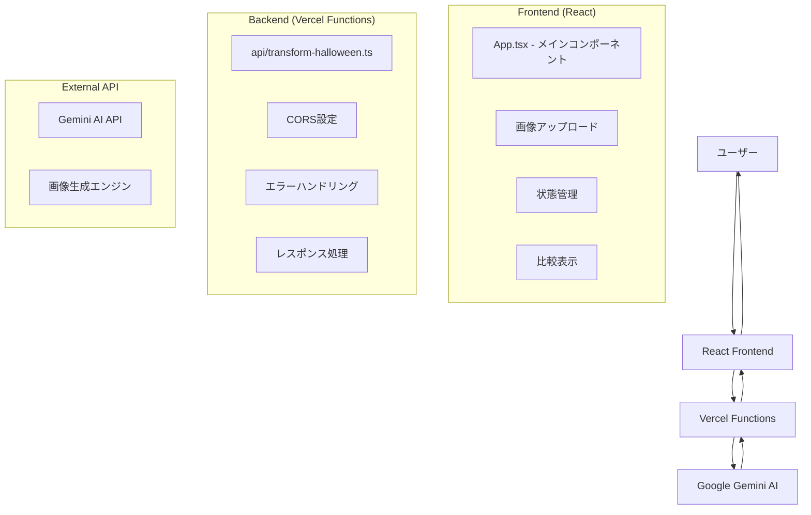

包括的な README.md を作成します。

# README.md

````markdown
# 🎃 ハロウィン写真変換アプリ

AI を使って写真をハロウィン風に変換する Web アプリケーションです。Google Gemini AI の画像生成機能を活用し、アップロードした写真にハロウィンコスチュームや装飾を自動で追加します。

## 🌟 主な機能

- **AI 画像変換**: Google Gemini AI によるハロウィン風画像生成

## 🛠 使用技術

### フロントエンド

- **React** -
- **TypeScript**
- **Vite** - 高速ビルドツール

### バックエンド

- **Vercel Functions** - サーバーレス関数
- **Node.js** - サーバーサイドランタイム

### AI・API

- **Google Gemini AI** - 画像生成 API（gemini-2.5-flash-image-preview）

### デプロイ・インフラ

- **Vercel** - ホスティング・CI/CD
- **GitHub** - ソースコード管理

## アーキテクチャ


````

## プロジェクト構成

```
halloween-app/
├── src/
│   ├── App.tsx                 # メインコンポーネント
│   ├── App.css                 # スタイル定義
│   ├── main.tsx               # エントリーポイント
│   └── vite-env.d.ts          # Vite型定義
├── api/
│   └── transform-halloween.ts  # Vercel Function
├── public/                     # 静的ファイル
├── package.json               # 依存関係
├── tsconfig.json              # TypeScript設定
├── vite.config.ts             # Vite設定
├── vercel.json                # Vercel設定（オプション）
└── README.md                  # このファイル
```

## 🧩 主要コンポーネント詳細解説

### 1. App.tsx - メインコンポーネント

アプリケーションの中核となる React コンポーネント

#### 主要機能

- **状態管理**: 画像データ、変換状態、エラー状態を管理
- **ファイルハンドリング**: 画像のアップロード・プレビュー・Base64 変換
- **API 通信**: Vercel Functions との通信処理
- **UI 制御**: ローディング表示、エラー表示、結果表示の制御

#### 重要な状態変数

```typescript
const [selectedImage, setSelectedImage] = useState<File | null>(null); // 選択された画像ファイル
const [transformedImage, setTransformedImage] = useState<string | null>(null); // 変換後画像（base64）
const [previewUrl, setPreviewUrl] = useState<string>(""); // プレビュー用URL
const [loading, setLoading] = useState<boolean>(false); // ローディング状態
const [error, setError] = useState<string | null>(null); // エラー状態
```

#### 主要関数

- `handleImageSelect()`: 画像選択時の処理
- `fileToBase64()`: File オブジェクトを Base64 文字列に変換
- `transformToHalloween()`: AI 変換のメイン処理
- `handleDownload()`: 変換画像のダウンロード
- `handleReset()`: 状態のリセット

### 2. api/transform-halloween.ts - Vercel Function

サーバーサイドで Gemini AI との通信を担当する API 関数

#### セキュリティ機能

- **API キー保護**: 環境変数で Gemini API Key を安全に管理
- **CORS 設定**: フロントエンドからのリクエストを許可
- **入力検証**: 画像データの妥当性チェック
- **エラーハンドリング**: 適切な HTTP ステータス・エラーメッセージの返却

#### 処理フロー

```typescript
1. リクエスト検証（POST method, 画像データ存在確認）
2. Base64データの抽出・デコード
3. Gemini APIへのリクエスト送信
4. レスポンス解析・画像データ抽出
5. フロントエンドへの結果返却
```

#### Gemini API 仕様

- **モデル**: `gemini-2.5-flash-image-preview`
- **入力**: テキストプロンプト + Base64 画像データ
- **出力**: 変換された画像データ（inline_data 形式）

## 🚀 セットアップ・実行方法

### 前提条件

- Google Gemini API Key 　取得

### 1. リポジトリのクローン

```bash
git clone https://github.com/MaTTalv001/matta-halloween.git
cd matta-halloween
```

### 2. 依存関係のインストール

```bash
npm install
```

### 3. 環境変数の設定

```bash
# .env.local ファイルを作成
touch .env.local

# 以下を記載（YOUR_API_KEYを実際のキーに置換）
echo "GEMINI_API_KEY=YOUR_GOOGLE_GEMINI_API_KEY" >> .env.local
```

#### Google Gemini API Key の取得方法

1. [Google AI Studio](https://aistudio.google.com/) にアクセス
2. Google アカウントでログイン
3. 「Get API Key」から API キーを生成
4. 生成されたキーを.env.local に設定

### 4. ローカル開発サーバーの起動

```bash
# Vercel Dev
npm install -g vercel
vercel dev

# または通常のVite開発サーバー
npm run dev
```

### 5. アクセス

- Vercel Dev: http://localhost:3000
- Vite Dev: http://localhost:5173

## 本番デプロイ（Vercel）

### 1. Vercel アカウント作成

[Vercel](https://vercel.com)

### 2. GitHub リポジトリ連携

1. Vercel Dashboard → "New Project"
2. GitHub リポジトリを選択して Import

### 3. 環境変数設定

```bash
GEMINI_API_KEY=your_actual_api_key
```

Production・Preview・Development すべてにチェック

### 4. 自動デプロイ

GitHub に push すると自動的にデプロイ
